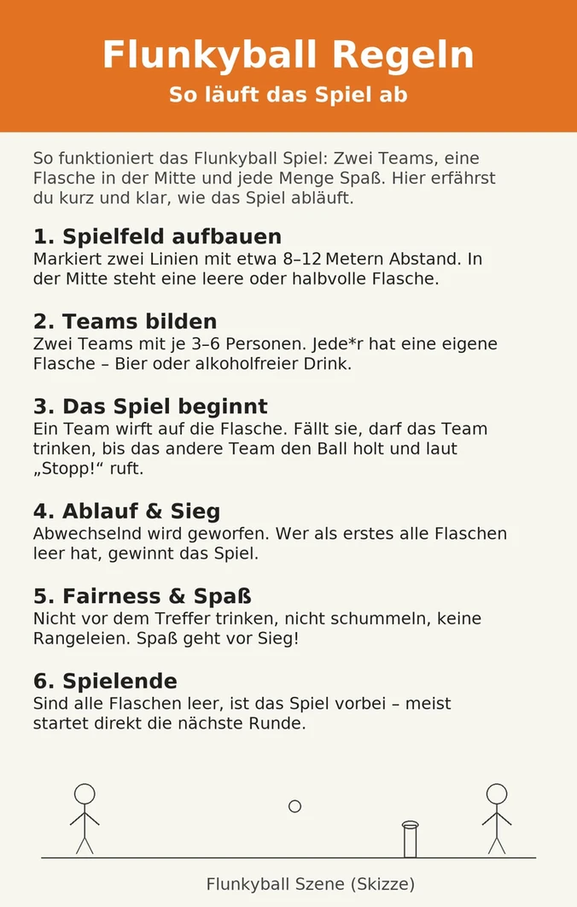

Flunkyball ist schnell erklärt, aber schwer zu beherrschen — genau das macht es zum perfekten Einstieg in jeden Partyabend. Hier kommen die kompletten Regeln, damit Ihr direkt loslegen könnt.

## Was ist Flunkyball?

Flunkyball ist ein Teamspiel, bei dem zwei Mannschaften gegeneinander antreten. Jeder Spieler hat ein Getränk vor sich. Das Ziel: die Flasche in der Mitte mit einem Ball umwerfen und dann so viel trinken wie möglich, bevor das gegnerische Team den Ball zurückgebracht hat.

## Das braucht Ihr

- 2 Teams (je 3–6 Spieler)
- 1 Ball (klassisch: Softball oder Fußball)
- 1 Flasche oder Dose pro Spieler (0,5 l)
- 1 Flasche als Ziel in der Mitte (leer oder halb voll)
- Genug Platz auf Wiese oder Park

## Die Grundregeln

### Aufstellung

Beide Teams stellen sich in einer Reihe gegenüber auf, etwa 10–15 Meter auseinander. In der Mitte steht die Zielflasche aufrecht.

### Spielablauf

1. **Ein Spieler wirft** den Ball und versucht, die Zielflasche umzuwerfen.
2. **Flasche umgeworfen?** Das gesamte werfende Team darf sofort trinken.
3. **Gegnerisches Team rennt** zur Flasche, stellt sie wieder auf und ruft laut: **„STOPP!"**
4. Ab dem Stopp-Ruf **muss das Trinkteam sofort aufhören** zu trinken.
5. Dann ist das andere Team an der Reihe zu werfen.
6. **Gewonnen hat das Team**, dessen alle Spieler ihr Getränk als erstes geleert haben.

### Wichtige Regeln

- **Werfen nur von der eigenen Linie** — wer vorläuft, muss zurück.
- **Getränk muss während des Trinkens auf Hüfthöhe** gehalten werden (je nach Variante).
- **Stopp gilt sofort** — wer danach noch einen Schluck nimmt, muss ein Strafgetränk öffnen.

## Häufige Varianten

### „Biathlon-Flunkyball"
Trifft ein Spieler nicht, muss er eine Strafrunde trinken, bevor er das nächste Mal werfen darf. Erhöht den Druck deutlich.

### „King Flunkyball"
Wer die Flasche umwirft, darf sofort eine Regel festlegen — z. B. „alle trinken mit links" oder „kein Lachen beim Trinken". Regeln gelten für den Rest des Spiels.

### Teamgröße anpassen
Bei Partys mit vielen Leuten einfach die Teams vergrößern und mehrere Flaschen in die Mitte stellen. Für jede umgeworfene Flasche gibt es eine Trinkphase.

## Flunkyball + Dare Pong: Die perfekte Kombination

Wenn Ihr schon mal eine Flunkyball-Runde hinter Euch habt und die Stimmung noch weiter anheizen wollt, ist [Dare Pong](https://www.darepong.eu/) die logische Erweiterung.

Statt einfach nur zu trinken, wenn Euer Becher getroffen wird, müsst Ihr eine Dare erfüllen — oder trinken. 120 sorgfältig ausgewählte Karten, alle 100% wasserfest, damit auch der unvermeidliche Bierverschüttunfall kein Problem ist.

## Fazit

Flunkyball ist ein Klassiker aus gutem Grund: die Regeln sind in zwei Minuten erklärt, man braucht fast nichts, und der Spaßfaktor skaliert direkt mit der Gruppe. Wer die Regeln drauf hat und mehr will, greift zu Dare Pong.
