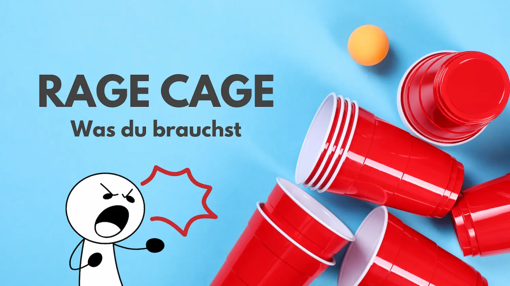

Du suchst nach einem Trinkspiel, das schnell, laut und einfach nur verrückt ist? Dann bist du beim **Rage Cage** genau richtig. Das Spiel bringt Chaos, Spaß und jede Menge Action auf jede Party. Kein Wunder, dass das **Rage Cage Trinkspiel** bei Studenten, in WGs und auf Festivals so beliebt ist.



## Was ist Rage Cage und was braucht man für das Spiel?

Fragst du dich: **Was ist Rage Cage eigentlich?** Dann stell dir ein Trinkspiel vor, das Geschwindigkeit, Chaos und jede Menge Gelächter vereint. Manche nennen es auch „Stack Cup“ oder „Boom Cup“, aber am Ende läuft es immer auf dasselbe hinaus: viele Becher, ein paar Ping-Pong-Bälle und der Versuch, schneller zu treffen als dein Nebenmann.

Das Schöne am **Rage Cage Trinkspiel**: Du brauchst kein kompliziertes Equipment, sondern nur ein paar Basics, die fast jeder Studentenhaushalt oder jede WG schon im Schrank hat.

Das gehört auf jeden Fall dazu:

- **Plastikbecher** (Red Cups) – am besten 20 bis 30 Stück. Die werden im Kreis aufgestellt und mit einem Schluck Bier oder Mischgetränk gefüllt.
- **Ein großer Becher in der Mitte** – er ist das „Endziel“, gerne auch Bitch-Cup genannt. Meist wird er bis zum Rand gefüllt und sorgt für die spannendste (und oft unangenehmste) Überraschung am Schluss. Solltet ihr nur eine Bechergröße haben, müsst ihr hier mehr Bier einfüllen, oder mit Schnaps & Co arbeiten.
- **Ping-Pong-Bälle** – mindestens zwei Stück. Ohne sie läuft gar nichts.
- **Getränke deiner Wahl** – klassisch ist Bier, aber du kannst auch Radler, Cider oder leichte Mischgetränke nehmen.

So entsteht ein Spielfeld, das auf den ersten Blick harmlos aussieht, aber im Laufe des Spiels schnell zur tobenden Party-Arena wird. Schon nach den ersten Würfen merkst du: Hier zählt nicht nur Geschick, sondern auch Reaktion, Schnelligkeit – und ein bisschen Glück.

## Die Rage Cage Regeln

Jetzt wird's wild – hier kommen die offiziellen **Rage Cage Regeln**, so wie sie wirklich gespielt werden. Schnell, laut, chaotisch – und einfach verdammt witzig.

### 🔥 So funktioniert's – Schritt für Schritt

1. **Startaufstellung** Zwei Spieler stehen sich gegenüber. Beide bekommen je einen Ping-Pong-Ball. Der Tisch ist voll mit gefüllten Bechern in der Mitte – einer davon ist der große „King's Cup“.

2. **„3, 2, 1 – Rage Cage!“** Die beiden starten gleichzeitig. Erst wird ein Becher aus der Mitte gegriffen und geext. Danach versucht man, den Ball mit einem Aufsetzer (also einmal auf dem Tisch auftippen lassen) in den leeren Becher zu treffen.

3. **Treffer? Nächster!** Triffst du, gibst du Becher + Ball **nach links** weiter. Wirfst du **beim allerersten Versuch direkt rein**, darfst du ihn sogar **an eine beliebige Person** weitergeben – das bringt extra Tempo ins Spiel.

4. **Becher-Showdown** Kommt es dazu, dass zwei Becher direkt hintereinander unterwegs sind und der hintere trifft, **muss er seinen Becher in den des Spielers vor ihm reinstellen**. Das ist ein Rage-Moment – und sorgt für Chaos.

5. **Gefangen? Trink!** Wurdest du „eingeholt“ (also hat der hinter dir getroffen, bevor du es geschafft hast), musst du einen neuen Becher aus der Mitte exen und ab sofort mit diesem weiterspielen. Der Ball bleibt bei dir, der Stapel geht an den linken Nachbarn.

6. **Wichtig beim Nachbarn links** Wenn du direkt **links neben jemandem** sitzt und triffst beim ersten Versuch: **Du darfst den Becher nicht irgendwohin geben**, sondern **musst ihn in seinen Becher reinstellen**. Trifft er zuerst, geht's für ihn normal weiter.

Zu wenige Mitspieler? Hier findest du die [besten Trinkspiele zu zweit](/post/trinkspiele-zu-zweit)!

## Rage Cage Trinkspiel | Die perfekte Strategie

Klar: Bei **Rage Cage** geht's in erster Linie um Spaß. Aber wer nicht ständig den großen Becher trinken will, sollte ein paar Dinge beachten. Mit der richtigen Strategie kommst du weiter – und hast trotzdem jede Menge Gaudi dabei.

### 🧠 Die besten Tipps für kluge Rage Cage-Spieler

- **Wirf schnell und ohne zu zögern.** Nicht lange überlegen – trinken, werfen, weitermachen. Je flüssiger du bist, desto schwerer wirst du eingeholt.
- **Ziel lieber auf den Tisch als direkt in den Becher.** Der Ball muss einmal aufkommen – ein flacher, kontrollierter Wurf bringt mehr als ein wilder Heber.
- **Augen auf den linken Nachbarn!** Wenn du merkst, dass er gerade erst anfängt zu trinken, kannst du ihn mit einem schnellen Treffer direkt unter Druck setzen – oder sogar einholen.
- **Bleib ruhig.** Gerade wenn's laut wird und alle durcheinander rufen, hilft dir Ruhe mehr als Hektik. Wer panisch wirft, trifft selten.

### 🎯 Taktik-Tipp: Wenn du direkt triffst…

Wenn du den Ball **gleich beim ersten Versuch** triffst, darfst du den Becher **an eine beliebige Person** weitergeben. Und genau hier kommt deine Chance:

➡️ **Gib ihn an jemanden, der gerade nicht aufpasst.** Vielleicht quatscht der gerade oder lacht noch über den letzten Treffer – perfekte Zielscheibe.
➡️ **Setz gezielt jemanden unter Druck.** Zum Beispiel die Person, die du vorher eingeholt hast – Revanche!
➡️ **Immer vor den anderen Spieler.** Gib den Becher an die Person links des Spielers mit dem anderen Ball. So wird die Runde schnell und dieser Spieler muss schnell treffen. Alternativ ist auch der Spieler davor ein gutes Ziel, denn er hat die Möglichkeit den Spieler zu seiner Linken zum Trinken zu bringen.

Am Ende bleibt's dabei: Rage Cage ist laut, wild und witzig – aber wer clever spielt, trinkt weniger. Oder zumindest nicht den großen Becher ganz am Schluss. 😄

Lesetipp: Entdecke [die besten Trinkspiele mit Karten](/post/trinkspiele-mit-karten).

## Rage Cage Lied | Diese Songs sind besonders beliebt

Musik ist bei **Rage Cage** fast genauso wichtig wie die Becher und der Ball. Ohne den richtigen Sound wirkt das Spiel halb so wild – mit dem passenden Song dagegen wird's zur Eskalation pur.

### 🎵 Aber welches Lied passt am besten?

Viele Gruppen spielen Rage Cage mit einem festen Song – **ein einziges Lied, das die ganze Runde durchläuft**. Dieses Lied läuft dann **in Dauerschleife**, bis der letzte Becher in der Mitte getrunken wurde. Das sorgt für ein ganz eigenes Partygefühl: Du hörst es, und alle wissen sofort – *"Jetzt geht's los!"*

### 🏆 Ikonische Rage Cage Songs

Diese Songs sind inzwischen fast schon Klassiker fürs Spiel – entweder wegen ihres Tempos, ihres Beats oder weil sie einfach pure Eskalation auslösen:

- **"Gas Gas" – Goran Bregovic** Alle wollen dieses Lied zu Rage Cage hören. Aber Vorsicht, es macht wahnsinnig. Praktischerweise gibt es auf Youtube direkt eine Version, die eine Stunde lang geht...
- **"Shots" – LMFAO feat. Lil Jon** Der Text passt, der Beat knallt – und jeder schreit mit.
- **"Turn Down for What" – DJ Snake & Lil Jon** Laut, wild, perfekt für die Hektik auf dem Tisch.
- **"Sandstorm" – Darude** Wenn du willst, dass alle ausrasten. Hier zählt nur noch Speed.
- **"Levels" – Avicii** Ideal, wenn du's etwas melodischer, aber trotzdem treibend magst.
- **"Animals" – Martin Garrix** Elektronisch, ohne Pause – das Spieltempo steigt automatisch.

Manche Gruppen nutzen aber auch bewusst **langsamer startende Songs**, die sich im Verlauf steigern – das passt gut zum Spannungsbogen beim Spiel. Beispiele:

- **"Bohemian Rhapsody" – Queen** (als Spaß-Variante)
- **"Can't Hold Us" – Macklemore**

Keine Lust der DJ zu sein? Hier ein paar Empfehlungen für Rage Cage Playlists:

- <https://open.spotify.com/playlist/0NSJV6IOzBItyU6nNLG6LN>
- <https://open.spotify.com/playlist/4mUYeW6jV2TTrMBqiJdas0>
- <https://www.youtube.com/playlist?list=PLw8uEms2cdQa2RtXWqvet-we3h5gf8qM8>

## Wie kann man das Rage Cage Drinking Game noch lustiger machen?

Eins vorweg: **Rage Cage ist schon ziemlich unterhaltsam**, so wie es ist. Aber wenn ihr öfter spielt oder einfach mal was Neues ausprobieren wollt, gibt's jede Menge Möglichkeiten, das Spiel noch wilder, chaotischer oder einfach witziger zu gestalten.

Hier ein paar Ideen, mit denen du das **Rage Cage Drinking Game** auf ein neues Level hebst:

### 🎯 1. Special-Becher einbauen

Einige Becher in der Mitte kannst du mit besonderen Drinks füllen:

- z. B. **Shots mit Hochprozentigem**,
- ein **sehr saurer Drink**,
- ein Mix aus allem (der „Schreckensbecher“).

Wer diesen Becher erwischt, muss durch. Das sorgt garantiert für Reaktionen – und für noch mehr Spannung, wenn's zum nächsten Becher geht.

### 🎭 2. Aufgaben für Verlierer

Wem der Becher in den Becher gestellt wird (also wer „eingeholt“ wird), der muss nicht nur trinken, sondern zusätzlich eine kleine Aufgabe erledigen. Zum Beispiel:

- einen Witz erzählen,
- eine Runde tanzen,
- ein peinliches Geständnis machen,
- mit Dialekt sprechen bis zum nächsten Wurf.

So kommt noch mehr Stimmung rein – und der Trash-Faktor steigt. Perfekt geeignet ist dazu natürlich [Dare Pong](https://www.darepong.eu). Einfach die Dares unter die Becher legen und genießen!

### 👕 3. Kostüm-/Mottopartys

Kombiniere das Spiel mit einem Motto:

- **90s Rage Cage**,
- **Sportler vs. Nerds**,
- **Pyjama-Edition**,
- oder einfach alle in **schrägen Hüten**.

Das nimmt das Spiel nicht zu ernst – und sorgt für legendäre Fotos.

Ihr habt gutes Wetter? Hier findest du [tolle Trinkspiele für Draußen](/post/trinkspiele-draussen)!

### 👯 4. Rage Cage in Teams

Wenn ihr viele Leute seid: Spielt in Teams! Zwei Spieler teilen sich einen Ball und wechseln sich ab – das fördert Zusammenarbeit (oder Chaos). Auch gut: Ein Team ruft, das andere trinkt – wer lauter ist, gewinnt.

### 📦 5. Mystery-Box / Regelkarten

Bereite vorher kleine Karten vor, auf denen Sonderregeln stehen. Ziehen darf man z. B. wenn man zum dritten Mal in Folge eingeholt wird. Beispiele:

- „Du darfst deinen nächsten Becher weitergeben“
- „Beim nächsten Wurf musst du mit der schwachen Hand werfen“
- „Trinke doppelt, aber bestimme einen Mitspieler, der mittrinkt“

Das bringt neuen Schwung rein – besonders bei Gruppen, die das Spiel schon oft gespielt haben.

### 📷 6. Live-Kommentar & Highlights

Schnappt euch eine Kamera oder macht Insta-Stories. Noch besser: Lasst einen Mitspieler das Spiel als „Sport-Kommentator“ begleiten. Sätze wie „Oh, da zittert der Becher!“, „Mutiger Wurf – und er geht rein!“ machen das Ganze noch absurder – aber genau das ist der Spaß.
